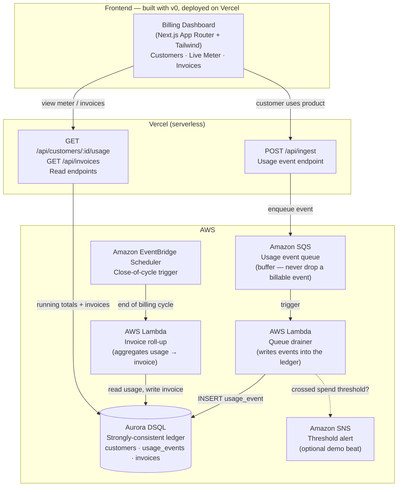

# Ledgerline — Architecture

**Ledgerline** is a usage-based billing meter for B2B SaaS companies, built on **Aurora DSQL** so the meter stays strongly consistent with no primary/replica setup to manage. This document is the canonical architecture reference for the build.

---

## One-line thesis

> Usage events flow in through a buffered, never-dropped ingestion path, land in a strongly-consistent Aurora DSQL ledger, accrue into running totals per customer, and roll up into invoices on a schedule — billing infrastructure that a B2B SaaS would otherwise dread building in-house.

---

## System diagram

---

## Why each component exists

This is the part a judge from the AWS Databases org cares about. Every box has a reason tied to *billing correctness*, not decoration.

| Component | Why it's here (the engineering decision) |
|---|---|
| **Aurora DSQL** | The star. A billing ledger must never double-count and must agree with itself everywhere. DSQL is strongly consistent and serverless with **no primary/secondary nodes to configure and no failover to manage** — exactly the guarantee a meter needs. Postgres-compatible, so v0/Next.js talk to it like normal Postgres. |
| **Amazon SQS** | A dropped event is lost revenue. The ingest endpoint must never block on a DB write or lose an event under a traffic spike. SQS buffers events durably between the API and the ledger. This decoupling is the single most defensible architectural choice in the system. |
| **AWS Lambda (drainer)** | Drains the queue into DSQL. Serverless, scales with queue depth, idle-cost zero. The right tool for "process each billable event exactly once." |
| **EventBridge Scheduler** | Billing happens *at a time* (end of cycle), not continuously. A scheduled trigger expresses "close the books" cleanly. 14M free invocations/month; we need ~1. |
| **AWS Lambda (roll-up)** | Aggregates a cycle's usage into an invoice. Separated from the drainer because ingestion and billing are different concerns on different cadences. |
| **Amazon SNS** (optional) | Real billing systems warn customers before a surprise bill. One threshold alert = a strong 10-second demo beat. Skip if time-constrained. |
| **v0 + Vercel** | v0 scaffolds the dashboard + API routes fast; Vercel hosts them. Required by the hackathon stack. The *frontend* is deliberately the fast part so engineering hours go to the ledger. |

---

## Data flow, narrated (this is the demo script's backbone)

1. **A customer uses the product** → the app calls `POST /api/ingest` with a usage event (which customer, which metric, how much, when).
2. **The event is buffered** on SQS — acknowledged instantly, never dropped, even under load.
3. **A Lambda drains the queue** and writes each event into the DSQL `usage_events` table. Because DSQL is strongly consistent, the write is durable and globally agreed the moment it commits.
4. **The dashboard shows the meter accruing** — read endpoints query DSQL for the running total and live event feed per customer.
5. **At end of cycle**, EventBridge Scheduler fires a Lambda that reads the cycle's usage, applies pricing, and writes an `invoices` row.
6. **(Optional)** If a customer crosses a spend threshold during ingestion, SNS fires an alert.

---

## The two guarantees Ledgerline sells

These map directly to the bottom of the workflow chart and are the lines to repeat in the demo:

- **Never double-counts.** Each usage event is recorded once and never lost — SQS guarantees delivery, DSQL guarantees a consistent commit.
- **Same totals everywhere.** Aurora DSQL is strongly consistent by design; any reader sees the same number. (Single-region for the build; multi-region is the design intent — narrate it, don't run it, to avoid extra DPU/storage cost.)

---

## Scope & cost guardrails for the build

- **Build single-region.** Multi-region writes double write-DPU cost and bill storage per region. Narrate the multi-region consistency story; optionally show a peered region briefly, then tear it down.
- **DSQL free tier:** 100,000 DPUs + 1 GB storage/month, permanent, scales to zero when idle. A hackathon dataset costs ~nothing.
- **SQS / Lambda / EventBridge / SNS** are all in the Always-Free tier at demo volume.
- **Set a $1 AWS budget alert before creating any resource.** Tear down the DSQL cluster when done — storage is the only meter that runs while idle (and 1 GB is free).
- **Keep all secrets in Vercel Environment Variables**, never in the repo (which must be public for submission).
